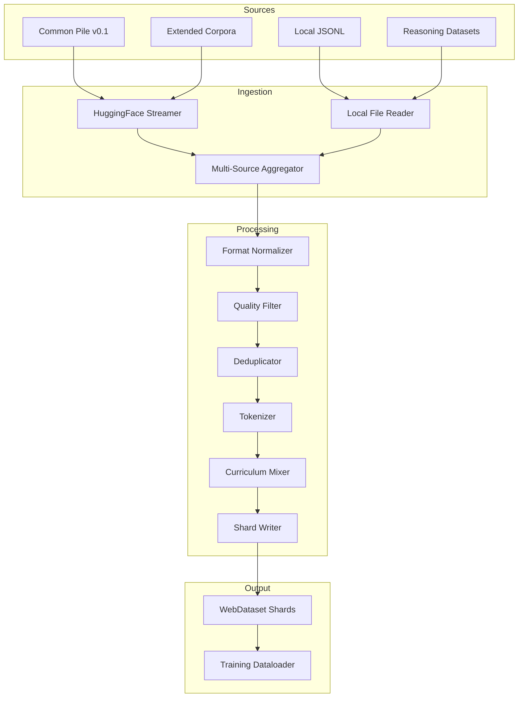

# PRD: Data Pipeline

## Product Overview

The CDRmix Data Pipeline is a scalable, multi-source data processing system that supports training across all 8 model variants (1B/4B/40B/200B × Core/Reasoning) with adaptive data handling strategies. The pipeline provides unified streaming from HuggingFace Common Pile v0.1 as the default source, with extensible support for local datasets, custom corpora, and reasoning-specific data augmentation.

## Architecture Summary

The data pipeline operates through seven core processing stages with adaptive scaling based on model requirements:

### Primary Data Sources
- **Default Source**: [Common Pile v0.1](https://huggingface.co/collections/common-pile/common-pile-v01-68307d37df48e36f02717f21) via HuggingFace streaming
- **Extended Sources**: Code repositories, mathematical datasets, curated web content, books (40B/200B models)
- **Local Sources**: Custom JSONL files, directory structures, preprocessed datasets
- **Reasoning Augmentation**: Long-context documents, chain-of-thought datasets, tool usage examples

### Pipeline Architecture
```
Data Sources → Format Normalization → Quality Filtering → Deduplication → 
Tokenization → Curriculum Assembly → Sharding → Training Consumption
```

## Functional Requirements

### FR-1: Multi-Source Data Ingestion
- **Requirement**: Unified interface supporting streaming, local, and hybrid data sources
- **HuggingFace Integration**:
  - Primary streaming from Common Pile v0.1 collection
  - Automatic dataset discovery and metadata parsing
  - Resumable downloads with progress tracking
  - Rate limiting and error handling for API stability
- **Local Data Support**:
  - Directory-to-JSONL conversion via `tools/directory_to_jsonl.py`
  - Multi-format ingestion (JSON, JSONL, TXT, MD, RST)
  - Recursive directory scanning with configurable extensions
  - Batch processing with memory-efficient streaming
- **Success Criteria**:
  - Support >10TB dataset streaming without memory overflow
  - Resume interrupted downloads within 5 minutes of failure
  - Process local directories with >1M files efficiently

### FR-2: Adaptive Format Normalization
- **Requirement**: Convert heterogeneous data formats into unified text representation
- **Format Support**:
  - Common Pile JSON objects with 'text' field extraction
  - JSONL line-by-line processing with configurable schema
  - Plain text files with encoding auto-detection (UTF-8 priority)
  - Markdown/ReStructuredText with header preservation
  - Code files with language-specific preprocessing
- **Normalization Pipeline**:
  - Document boundary preservation for coherent chunking
  - Metadata extraction and preservation (source, domain, quality scores)
  - Character encoding standardization with fallback handling
  - Line ending normalization for cross-platform compatibility

### FR-3: Intelligent Quality Filtering
- **Requirement**: Multi-stage filtering ensuring high-quality training data
- **Language Detection**:
  - Primary language identification with confidence scoring
  - Multi-language support with configurable language ratios
  - Code-switching detection for multilingual content
- **Content Quality Assessment**:
  - Length-based filtering (minimum 50 chars, maximum 1M chars default)
  - Heuristic quality scoring (punctuation, capitalization, repetition)
  - PII detection and scrubbing (emails, phone numbers, SSNs)
  - Profanity and harmful content filtering with customizable blocklists
- **Technical Quality Checks**:
  - HTML/XML tag detection and removal
  - URL extraction and normalization
  - ASCII art and formatting artifact removal
  - Encoding corruption detection

### FR-4: Advanced Deduplication System
- **Requirement**: Remove near-duplicate content while preserving valuable variations
- **Document-Level Deduplication**:
  - MinHash-based similarity detection with configurable thresholds (0.8 default)
  - SimHash for faster approximate duplicate detection
  - URL-based deduplication with domain clustering
  - Host-level deduplication for web-scraped content
- **Content-Level Deduplication**:
  - N-gram overlap detection for partial duplicates
  - Paragraph-level similarity with positional weighting
  - Template detection and removal (boilerplate, headers, footers)
- **Performance Requirements**:
  - Process 1TB datasets with <5% false positive rate
  - Linear scaling with dataset size through distributed processing
  - Memory usage <10GB for billion-document deduplication

### FR-5: Scale-Adaptive Tokenization
- **Requirement**: Efficient tokenization with model-specific optimizations
- **Tokenizer Management**:
  - Default: BPE-32k vocabulary (50,272 tokens) via `cdrmix-bpe`
  - Alternative: SentencePiece integration for custom vocabularies
  - Automatic vocabulary validation and OOV handling
  - Special token management for reasoning-specific markers
- **Sequence Processing**:
  - Fixed sequence length packing with document boundary respect
  - Configurable sequence lengths: 2048 (default), 4096, 8192, 16384
  - Document break preservation to maintain coherence
  - Attention mask generation for proper padding handling
- **Scale Optimizations**:
  - 1B/4B models: Standard sequence lengths (2048 tokens)
  - 40B/200B models: Extended sequences (4096-8192 tokens) for better long-context learning
  - Reasoning models: Variable-length sequences for reasoning task adaptation

### FR-6: Curriculum Learning System
- **Requirement**: Intelligent data mixing and presentation scheduling
- **Domain Balancing**:
  - Configurable domain ratios (web: 60%, books: 20%, code: 15%, academic: 5%)
  - Dynamic rebalancing based on model scale and type
  - Per-domain quality scoring and adaptive sampling
  - Freshness weighting for time-sensitive domains
- **Curriculum Strategies**:
  - Length-based progression (short → medium → long sequences)
  - Difficulty-based progression (simple → complex content)
  - Domain-specific scheduling (general → specialized knowledge)
  - Reasoning-specific augmentation for reasoning models
- **Temperature Sampling**:
  - Configurable sampling temperature (0.8-1.2) for diversity control
  - Annealing schedules for curriculum progression
  - Domain-specific temperature adjustment
  - Quality-weighted sampling with score-based biasing

### FR-7: Efficient Sharding and Distribution
- **Requirement**: Scalable data distribution supporting distributed training
- **Sharding Strategy**:
  - WebDataset format for efficient streaming I/O
  - TAR+index structure for random access capability
  - Resume-safe sharding with checkpoint metadata
  - Configurable shard sizes (1GB-10GB) based on model scale
- **Distribution Support**:
  - Multi-node data loading with deterministic ordering
  - Worker-aware sharding to prevent data overlap
  - Fault-tolerant resumption from arbitrary checkpoints
  - Load balancing across heterogeneous hardware

## Technical Requirements

### TR-1: Performance and Scalability
- **Throughput Targets**:
  - 1B models: >50GB/hour processing throughput
  - 4B models: >100GB/hour processing throughput  
  - 40B models: >200GB/hour processing throughput
  - 200B models: >500GB/hour processing throughput
- **Memory Efficiency**:
  - Peak memory usage <32GB for any single processing node
  - Streaming processing with configurable buffer sizes (1GB-8GB)
  - Automatic garbage collection and memory cleanup
  - Memory-mapped file access for large datasets

### TR-2: Fault Tolerance and Recovery
- **Checkpoint System**:
  - Automatic progress checkpointing every 1GB processed
  - Crash recovery with <1% data reprocessing overhead
  - Cross-node checkpoint synchronization for distributed processing
  - Metadata integrity validation on recovery
- **Error Handling**:
  - Graceful degradation for network interruptions
  - Automatic retry with exponential backoff (3 attempts default)
  - Corrupt data detection and isolation
  - Comprehensive error logging with actionable diagnostics

### TR-3: Quality Assurance and Monitoring
- **Quality Metrics**:
  - Real-time quality score distribution monitoring
  - Language distribution tracking and alerting
  - Deduplication effectiveness measurement
  - Content diversity assessment via n-gram analysis
- **Data Lineage**:
  - Complete provenance tracking from source to training
  - Sample-level metadata preservation
  - Reproducible data processing with deterministic ordering
  - Audit trail for compliance and debugging

### TR-4: Model-Specific Adaptations
- **Core vs Reasoning Models**:
  - Core models: Standard web text, books, and code
  - Reasoning models: +25% reasoning datasets (math, logic, science)
  - Long-context preference for reasoning models (4K+ token sequences)
  - Tool usage examples and API documentation for reasoning models
- **Scale-Based Configurations**:
  - 1B/4B: Common Pile v0.1 primary (300GB processed)
  - 40B/200B: Extended corpora integration (+2TB curated data)
  - Progressive quality thresholds (stricter for larger models)
  - Extended deduplication windows for large-scale training

## Implementation Architecture

### Component Structure

**Data Ingestion Layer** (`data/ingestion/`)
```python
class DataSource:
    def stream(self) -> Iterator[Dict[str, Any]]
    def validate(self) -> bool
    def estimate_size(self) -> int

class HuggingFaceStreamer(DataSource):
    def __init__(self, dataset_name: str, split: str = "train")
    def stream(self) -> Iterator[Dict[str, Any]]

class LocalDataSource(DataSource):
    def __init__(self, path: Union[str, Path], format: str = "auto")
    def stream(self) -> Iterator[Dict[str, Any]]
```

**Processing Pipeline** (`data/processors/`)
```python
class FormatNormalizer:
    def normalize(self, doc: Dict) -> Dict[str, str]
    def detect_format(self, doc: Dict) -> str

class QualityFilter:
    def __init__(self, language_codes: List[str], min_length: int, max_length: int)
    def filter(self, doc: Dict) -> Tuple[bool, float]  # (keep, quality_score)

class Deduplicator:
    def __init__(self, method: str = "minhash", threshold: float = 0.8)
    def deduplicate(self, docs: Iterator[Dict]) -> Iterator[Dict]
```

**Tokenization Layer** (`data/tokenizer/`)
```python
class TokenizerManager:
    def load_tokenizer(self, tokenizer_path: str) -> Tokenizer
    def tokenize_batch(self, texts: List[str]) -> BatchEncoding
    def pack_sequences(self, tokens: List[List[int]], seq_length: int) -> List[List[int]]
```

**Curriculum System** (`data/curricula/`)
```python
class CurriculumMixer:
    def __init__(self, domain_ratios: Dict[str, float], temperature: float = 1.0)
    def sample_batch(self, sources: Dict[str, Iterator], batch_size: int) -> List[Dict]
    def update_ratios(self, epoch: int, metrics: Dict[str, float]) -> None
```

### Data Pipeline Flow



### Configuration Integration

**YAML Configuration Extension**:
```yaml
data:
  sources:
    - name: "common_pile_v01"
      type: "huggingface"
      dataset: "common-pile/common-pile-v01"
      streaming: true
      split: "train"
    - name: "custom_reasoning"
      type: "local" 
      path: "/data/reasoning_datasets/"
      format: "jsonl"
  
  processing:
    quality_threshold: 0.6  # 0.4 for 1B, 0.8 for 200B
    dedup_threshold: 0.85
    sequence_length: 2048   # 4096 for reasoning models
    
  curriculum:
    domain_ratios:
      web: 0.60
      books: 0.20  
      code: 0.15
      academic: 0.05
    reasoning_boost: 0.25   # additional reasoning data for reasoning models
```

## Success Metrics

### Processing Performance
- **Throughput**: Meet scale-specific processing targets (50-500 GB/hour)
- **Quality Retention**: >95% of high-quality content preserved through filtering
- **Deduplication Effectiveness**: <2% near-duplicate content in final dataset
- **Memory Efficiency**: <32GB peak memory usage regardless of dataset size

### Data Quality Metrics
- **Language Accuracy**: >98% language detection accuracy on multilingual content
- **Content Diversity**: Shannon entropy >4.5 bits for n-gram distribution
- **Toxicity Rate**: <0.1% harmful content in processed dataset
- **Reasoning Data Ratio**: 25% reasoning-specific content for reasoning models

### System Reliability
- **Fault Recovery**: <1% data loss on system failures with checkpoint recovery
- **Processing Consistency**: Deterministic output across multiple runs with same configuration
- **Scalability**: Linear throughput scaling with additional processing nodes
- **Integration**: Zero data pipeline failures in end-to-end training workflows

## Dependencies

### Core Dependencies
- **HuggingFace Datasets**: Streaming API for Common Pile v0.1 access
- **WebDataset**: Efficient sharding and streaming for distributed training
- **FastText/spaCy**: Language detection and text processing
- **MinHashLSH**: Scalable deduplication for large datasets

### Data Storage Requirements
- **Streaming Buffer**: 10-50GB local SSD cache per processing node
- **Intermediate Storage**: 2-5x source dataset size for processing stages
- **Final Shards**: 300GB (1B/4B) to 2.5TB (40B/200B) for processed datasets
- **Network Bandwidth**: >1Gbps for efficient streaming from HuggingFace

### Processing Infrastructure
- **CPU**: 16+ cores recommended for quality filtering and deduplication
- **Memory**: 32-128GB RAM based on model scale and parallel processing
- **Storage**: NVMe SSD for intermediate processing, network storage for final shards
- **Network**: High-bandwidth connection for streaming and distributed coordination

## Validation Plan

### Component Testing
1. **Data Source Integration**: Validate streaming from Common Pile v0.1 with rate limiting
2. **Processing Pipeline**: End-to-end testing with synthetic datasets of known properties
3. **Quality Filtering**: Precision/recall testing on manually annotated samples
4. **Deduplication**: Effectiveness testing with injected duplicates and near-duplicates

### Scale Testing
- **1B Model Pipeline**: 300GB dataset processing with quality validation
- **4B Model Pipeline**: Extended processing with reasoning data integration
- **40B Model Pipeline**: Multi-TB processing with extended corpora
- **200B Model Pipeline**: Full-scale processing with fault tolerance validation

### Integration Testing
- [ ] Common Pile v0.1 streaming integration with authentication and rate limiting
- [ ] Local dataset processing with tools/directory_to_jsonl.py integration
- [ ] Multi-source aggregation with domain balancing verification
- [ ] Tokenizer integration with all supported vocabulary formats
- [ ] Curriculum learning effectiveness on downstream task performance
- [ ] Distributed sharding with multi-node training pipeline integration

## Risk Mitigation

### Data Availability Risks
- **HuggingFace Outages**: Local caching with 7-day retention for critical datasets
- **Network Failures**: Automatic failover to local sources during connectivity issues  
- **Rate Limiting**: Distributed downloading across multiple API keys/endpoints
- **Data Corruption**: Multi-level checksums with automatic re-download on validation failure

### Processing Performance Risks
- **Memory Exhaustion**: Dynamic batch size adjustment based on available memory
- **CPU Bottlenecks**: Auto-scaling processing workers based on throughput monitoring
- **Storage Limitations**: Automatic cleanup of intermediate files with configurable retention
- **Network Bandwidth**: Adaptive streaming rates with congestion detection

### Quality and Compliance Risks
- **Data Quality Degradation**: Continuous quality monitoring with automatic alerts
- **Licensing Issues**: Comprehensive license tracking and compliance validation
- **Privacy Concerns**: Enhanced PII detection with regular pattern updates
- **Bias Amplification**: Content diversity monitoring with demographic representation tracking