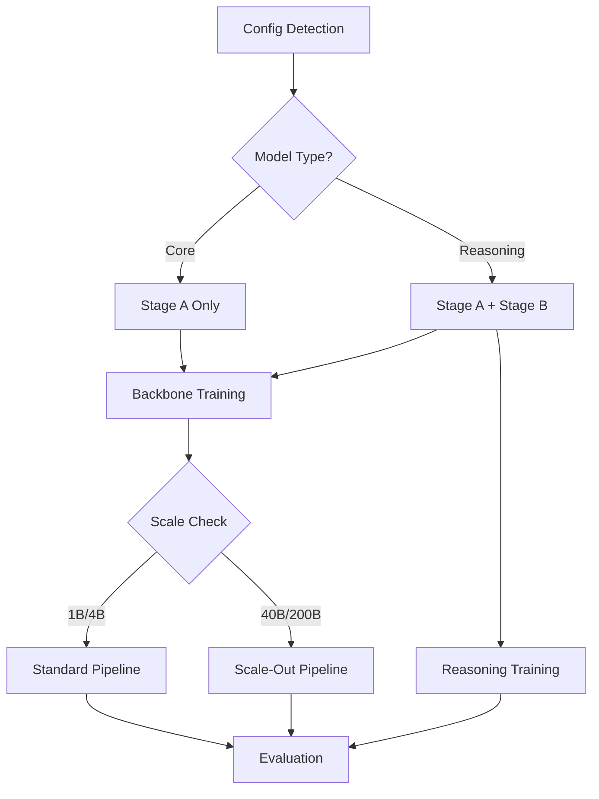

# PRD: Training Pipeline

## Product Overview

The CDRmix Training Pipeline is a unified system capable of training 8 distinct model variants across two architectural types (Core and Reasoning) and four parameter scales (1B, 4B, 40B, 200B). The pipeline automatically configures training parameters, data handling, and distributed computing strategies based on the target model specification.

## Architecture Summary

### Model Variants
The pipeline supports two primary architectural patterns:

**Core Models** (cdrmix-core-*)
- Pure language modeling with RWKX-V backbone (25% Transformer, 75% RWKV blocks)
- MoE routing with 8 experts, top-k=2 selection
- Stage A pretraining only
- Parameter targets: 1B, 4B, 40B, 200B active parameters

**Reasoning Models** (cdrmix-reason-*)
- Core backbone extended with reasoning capabilities
- Hebbian plasticity adapters (plastic-LoRA)
- RL-MemAgent with policy/value heads for memory operations
- Working memory summarizer and episodic memory index
- Two-stage training: Stage A (backbone) + Stage B (reasoning enablement)
- Parameter targets: 1B, 4B, 40B, 200B active parameters

## Functional Requirements

### FR-1: Unified Configuration System
- **Requirement**: Single training command automatically detects model variant and configures pipeline
- **Implementation**: YAML-driven configuration with automatic parameter sizing via `core_param_autosizer.py` and `reasoning_param_autosizer.py`
- **Success Criteria**: 
  - `python3 src/train.py --config configs/cdrmix-core-1b.yaml` launches 1B core training
  - `python3 src/train.py --config configs/cdrmix-reason-40b.yaml` launches 40B reasoning training
  - Auto-detection of model type (core vs reasoning) from config structure

### FR-2: Variant-Aware Data Pipeline
- **Requirement**: Data loading and preprocessing adapts to model scale and type
- **Components**:
  - HuggingFace streaming loader (Common Pile v0.1)
  - Format normalizer (JSONL/Text/Doc → text)
  - Quality filters (language ID, length, heuristics, PII scrubbing)
  - Near-deduplication (SimHash/MinHash, URL/host dedup)
  - Curriculum mixing with domain/length balancing
- **Scale Adaptations**:
  - 1B/4B models: Standard Common Pile curriculum
  - 40B/200B models: Extended corpora (code, math, docs, curated web, books)
  - Reasoning models: Additional long-context and reasoning task data

### FR-3: Stage-Based Training Orchestration
- **Stage A (All Models)**: Backbone pretraining with cross-entropy loss
  - RWKX-V architecture building (top-of-x or interleave-x scheduling)
  - MoE routing with auxiliary losses (load_balance, z_loss)
  - Distributed training strategies (DDP + TP/PP + Expert Parallel)
- **Stage B (Reasoning Models Only)**: Reasoning capability enablement
  - Hebbian plasticity adapter training with correlation objectives
  - RL-MemAgent policy optimization (GRPO algorithm)
  - Memory system training (working memory, episodic index)

### FR-4: Scale-Adaptive Distributed Training
- **1B Models**: Single-node, multi-GPU training with DDP
- **4B Models**: Multi-node DDP with gradient accumulation
- **40B Models**: Tensor + Pipeline parallelism, gradient checkpointing, ZeRO optimization
- **200B Models**: Full parallelism stack (tensor + pipeline + sequence parallel), MoE expert sharding

### FR-5: Dynamic Parameter Scaling
Model parameters automatically scale based on configuration:

| Parameter | 1B | 4B | 40B | 200B |
|-----------|----|----|-----|------|
| d_model | 2048 | 3072 | 6144 | 12288 |
| n_layers | 24 | 36 | 64 | 96 |
| n_heads | 16 | 24 | 48 | 96 |
| expert_ffn_hidden | 4608 | 8192 | 16384 | 32768 |
| gradient_clip | 1.0 | 1.0 | 0.9 | 0.8 |
| init_std_scale | 1.0 | 1.0 | 0.9 | 0.8 |

**Reasoning-Specific Scaling**:
- Hebbian LoRA rank: 8/12/16/24
- Step budget: 64/96/128/160
- Memory dimensions: 512/640/768/1024
- RL horizon: 256/384/512/768

## Technical Requirements

### TR-1: Memory Management
- **40B/200B Models**: Mandatory activation checkpointing and sequence checkpointing for long horizons
- **All Models**: Mixed precision (bfloat16) training with automatic loss scaling
- **Reasoning Models**: Dynamic memory allocation for episodic storage and working memory

### TR-2: Fault Tolerance
- **Checkpointing**: Automatic checkpoint saving with EMA weights
- **Recovery**: Resume-safe data sharding with deterministic sampling
- **Monitoring**: Real-time loss tracking, MoE balance metrics, routing overflow detection

### TR-3: Evaluation Integration
- **Core Models**: Perplexity evaluation, zero-shot task performance, MoE capacity utilization
- **Reasoning Models**: Long-context reasoning benchmarks, memory efficiency metrics, RL policy convergence

### TR-4: Hardware Abstraction
- **Backend Support**: PyTorch/CUDA (primary), ROCm (AMD), Tenstorrent (planned)
- **Device Detection**: Automatic hardware capability detection and optimal configuration
- **Resource Optimization**: Memory-efficient attention, gradient communication optimization

## Implementation Architecture

### Pipeline Components

**Data Layer** (`data/ingestion/`, `data/tokenizer/`, `data/curricula/`)
```
HF Streaming → Format Normalize → Quality Filter → Dedup → Tokenize → Curriculum Mix → Shard
```

**Training Core** (`training/`)
- `build_backbone.py`: RWKX-V architecture construction
- `train_stageA.py`: Backbone pretraining orchestration  
- `train_stageB.py`: Reasoning capability training (reason models only)
- `dist/`: Distributed training utilities

**Configuration System** (`configs/`)
- Model YAML configurations for all 8 variants
- Parameter autosizers with scaling formulas
- Training hyperparameter schedules

### Training Flow



## Success Metrics

### Performance Targets
- **Training Throughput**: 
  - 1B models: >1000 tokens/sec/GPU
  - 4B models: >500 tokens/sec/GPU
  - 40B models: >100 tokens/sec/GPU
  - 200B models: >50 tokens/sec/GPU

### Quality Metrics
- **Core Models**: Competitive perplexity vs. equivalent parameter baselines
- **Reasoning Models**: >90% task completion on reasoning benchmarks
- **MoE Efficiency**: <5% expert overflow, balanced load distribution (entropy >2.5)

### System Reliability
- **Fault Recovery**: <1% training time lost to failures
- **Memory Efficiency**: <90% peak GPU memory utilization
- **Reproducibility**: Deterministic results with seed control

## Dependencies

### Data Requirements
- **Primary Dataset**: Common Pile v0.1 (filtered) - 300GB tokenized
- **Extended Corpora** (40B/200B): Additional 2TB of curated domain data
- **Tokenizer**: BPE-32k vocabulary (50,272 tokens)
- **Storage**: High-bandwidth shared filesystem for multi-node access

### Infrastructure Requirements
- **Development**: 8x A100 minimum for 1B models
- **Production**: 
  - 4B models: 2-4 nodes, 64-128GB RAM/node
  - 40B models: 8-16 nodes, 256GB RAM/node  
  - 200B models: 32+ nodes, 512GB RAM/node
- **Networking**: InfiniBand or equivalent for >100Gbps inter-node bandwidth

### Software Stack
- **Core**: Python 3.12+, PyTorch 2.0+, HuggingFace Transformers
- **Distributed**: DeepSpeed/FairScale for large-scale training
- **Monitoring**: Weights & Biases or MLflow integration
- **Data**: WebDataset for efficient streaming I/O

## Validation Plan

### Testing Strategy
1. **Unit Tests**: Individual component validation (data loader, model blocks, schedulers)
2. **Integration Tests**: End-to-end pipeline validation on small synthetic data
3. **Scale Tests**: Progressive validation (1B → 4B → 40B → 200B)
4. **Regression Tests**: Automated training convergence validation

### Acceptance Criteria
- [ ] All 8 model variants train to convergence without manual intervention
- [ ] Memory usage stays within 90% of available GPU memory
- [ ] Training can resume from checkpoint without quality degradation
- [ ] Distributed training shows >90% scaling efficiency up to target node count
- [ ] Core models achieve competitive benchmark performance
- [ ] Reasoning models demonstrate emergent reasoning capabilities

## Timeline & Milestones

### Phase 1 (Weeks 1-2): Core Infrastructure
- [ ] Data pipeline implementation and testing
- [ ] Stage A training loop with distributed support
- [ ] 1B/4B model validation

### Phase 2 (Weeks 3-4): Scale-Out & Reasoning
- [ ] 40B/200B distributed training implementation
- [ ] Stage B reasoning training pipeline
- [ ] Memory management and fault tolerance

### Phase 3 (Weeks 5-6): Integration & Validation
- [ ] Full pipeline integration testing
- [ ] Performance optimization and benchmarking
- [ ] Documentation and deployment preparation

## Risk Mitigation

### Technical Risks
- **Memory Constraints**: Implement progressive batch size reduction and gradient accumulation
- **Training Instability**: Extensive hyperparameter validation and automatic learning rate scheduling
- **Hardware Failures**: Robust checkpointing with multi-replica storage

### Resource Risks
- **Compute Availability**: Flexible scheduling with preemptible node support
- **Data Access**: Multi-tier storage with local SSD caching
- **Development Velocity**: Modular architecture enables parallel development streams